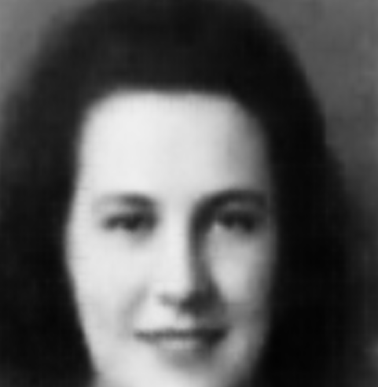
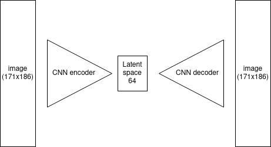
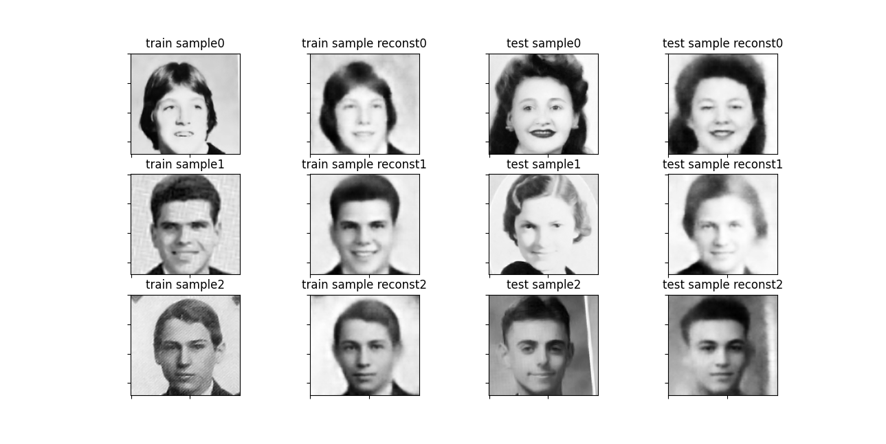
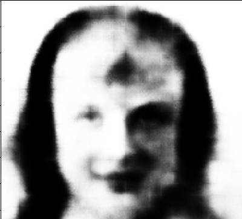

# ai-faces

## Description


<center>  </center>

This person does not exist; it was generated by altering features learned from this dataset : [A Century of Portraits](https://people.eecs.berkeley.edu/~shiry/projects/yearbooks/yearbooks.html) by a convolutional autoencoder.

### Showcase 

<center>  </center>


## Technical explanation
The convolutional autoencoder squeezes the higher dimensional space (171 x 186) through a lower dimensional bottleneck (64) by trying to reconstruct the original image

<center>  </center>

<center>  </center>

The PCA subspace of the lower dimension vectors is then calculated, and each knob corresponds to a bases vector. 

The most important feature seems to be background color, which makes sence because it takes a considerable part of the picture. The second most important feature is hair lenght / gender since both of them are kind of correlated. some other features control orientation and lighting and facial properties.

Sometimes, the result can be quite scary: 
<center>  </center>

### Dependencies
```
matplotlib==3.5.2
numpy==1.22.4
opencv_python==4.6.0.66
Pillow==9.1.1
pytorch_lightning==1.6.4
scikit_learn==1.1.1
torch==1.11.0
```
